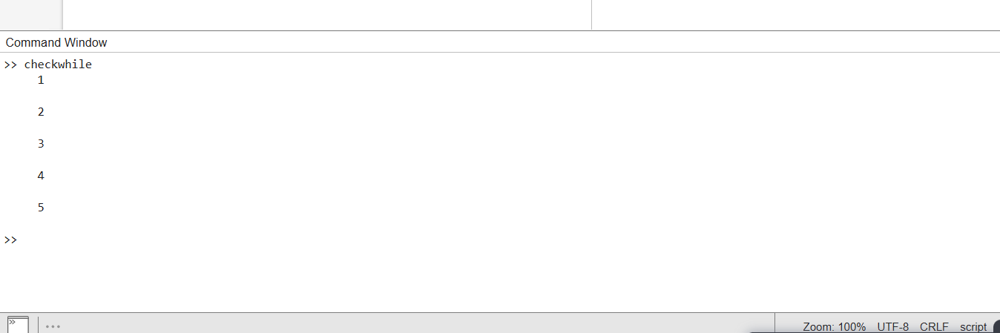
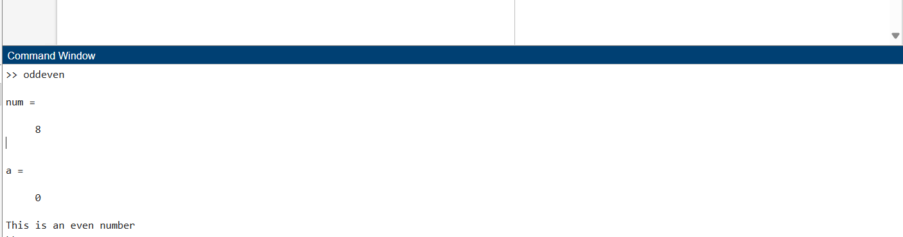

# IT2223 Algorithm Design and Analysis - Practicals 📊📐

A structured repository containing MATLAB implementations of foundational algorithms, searching and sorting techniques, graph traversals, tree structures, and performance/time complexity analyses developed for laboratory practicals.

---

## 📂 Repository Structure

```text
IT2223-Algorithm-Design-and-Analysis--Practical/
│
├── Codes/                    # Initial introductory scripts and syntax logic
│   ├── DAY_01.txt            # Day 1 session notes / logs
│   ├── checkwhile.m          # While-loop logic validation script
│   └── oddeven.m             # Even/odd number checker script
│
├── Output/                   # Generated visual plots and execution outputs
│   ├── checkwhile.png        # Execution plot / output visual
│   └── oddeven.png           # Execution plot / output visual
│
├── Searching/                # Searching algorithms and complexity analysis
│   ├── BinarySearch.m        # Binary search implementation
│   ├── LinearSearch.m        # Basic linear search implementation
│   ├── LinearSearch2.m       # Alternative linear search script
│   ├── TimeComplexity.m      # Empirical time complexity benchmarking script
│   └── *.png                 # Complexity performance charts (10, 100, 1000 elements)
│
├── Sorting/                  # Sorting algorithms
│   ├── BubbleSort.m          # Bubble sort implementation
│   ├── InsertionSort.m       # Insertion sort implementation
│   └── selectionsort.m       # Selection sort implementation
│
├── BFS.m                     # Breadth-First Search graph traversal script
├── DFS.m                     # Depth-First Search graph traversal script
├── GraphActivity1.m          # Graph theory activity implementation
├── GraphQs.m                 # Additional graph problems and questions
├── TreeWithWeights.m         # Weighted tree data structure handling
├── TreeWithoutWeights.m      # Unweighted tree structure handling
└── functionsQ.m              # Modular function practice scripts
```

## 🚀 Key Topics & Implementations Covered
1. Searching Algorithms: Implementation of Linear and Binary Search, paired with empirical time complexity analysis scripts and benchmark performance graphs (Searching/).
2. Sorting Algorithms: Classic comparison-based sorting algorithms including Bubble Sort, Insertion Sort, and Selection Sort (Sorting/).
3. Graph & Tree Theory: Graph exploration algorithms (BFS, DFS) along with custom modeling for weighted and unweighted trees.
4. MATLAB Fundamentals: Control flow structures, looping constructs, and basic utility programs (Codes/).

| Codes | Output |
|-------|--------|
|['checkwhile.m'](./Codes/checkwhile.m)||
|['oddeven.m'](./Codes/oddeven.m)||
